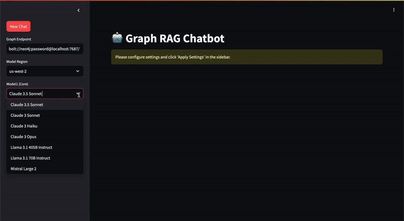
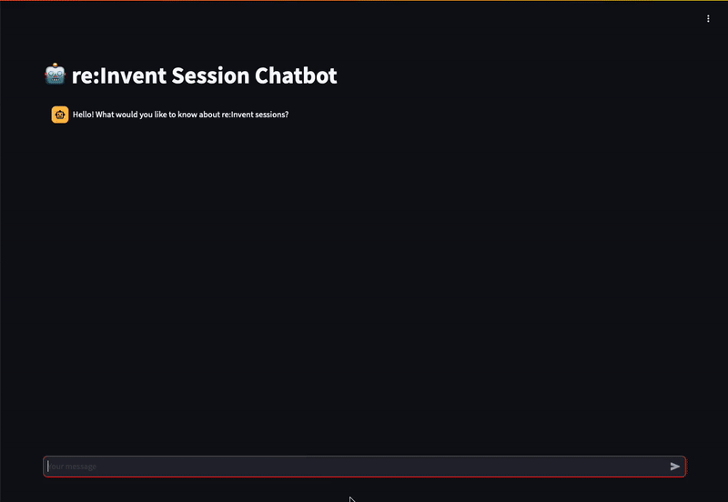

# Bedrock-based Chatbot Application


## Execution Steps

1. Install the required packages:
```
pip install -r requirements.txt
```

*Note: Since multiple libraries will be installed, dependency errors may occur depending on your environment. Check version compatibility with your existing environment before installation.

2. Run the desired chatbot application:
```
streamlit run {Chatbot file}.py
```

## Examples

### 1. **Basic Chat**
```
streamlit run 1.basic-chat.py
```


Features:

- Model selection
- System prompt input
- Model parameter control
- Multi-turn conversation support (chat history)
- Bedrock Converse API integration for model invocation

### 2. **Chat with Input**
```
streamlit run 2.chat-with-input.py
```


Features:

- Model selection
- System prompt input
- Model parameter control
- Multi-turn conversation support (chat history)
- File input support for Bedrock Converse API 
    - Supported types: Image, PDF, CSV, Python code, etc.

### 3. **Chat with Knowledge Base**
```
streamlit run 3.chat-with-knowledge-base.py
```


Features:

- Model selection
- KnowledgeBase list view (Requires prior creation in Amazon Bedrock console - [Link](https://docs.aws.amazon.com/bedrock/latest/userguide/knowledge-base-create.html))
- Context retrieval from KnowledgeBase ([Retrieve API](https://boto3.amazonaws.com/v1/documentation/api/latest/reference/services/bedrock-agent-runtime/client/retrieve.html#))
- Response generation based on retrieved context
- Source and score display for retrieved context


### 4. **Chat Text2SQL**

```
streamlit run 4.chat-text2sql.py
```


Features:

- Database querying based on user questions
- Direct database URI input or sample database usage ([Chinook DB](https://github.com/lerocha/chinook-database))
- Agentic Text2SQL workflow using Bedrock Converse API's Tool Use feature
- OpenSearch indexing of pre-prepared sample queries and schema documents
- RAG-based query composition
- Query execution on the database with CSV result export
- Query result visualization using Plotly

Example questions for testing:

- What are the top 10 countries by sales revenue in 2022?
- Monthly sales volume by country in 2023
- What was the best-selling genre in 2021?

For more detailed implementation information, please refer to: https://github.com/kevmyung/text-to-sql-bedrock


## 5. **Chat with Graph**



Features:

- Document chunking based on 'Heading' structure
- Hierarchical projection of headings into a Neo4j graph
- Context retrieval through heading name queries based on user questions
- Complementary use of graph search and vector search during exploration

Setup:

1. Install Docker:

```
sudo yum install -y docker
sudo systemctl start docker
```

2. Load pre-defined example file ([Bedrock manual](https://docs.aws.amazon.com/bedrock/latest/userguide/what-is-bedrock.html), 1625 pages PDF) into Neo4j graph:
```
bash script init-graph.sh
```

3. Run the application:
```
streamlit run 5.chat-with-graph.py
```

Example questions for testing:

- How to utilize custom models in Bedrock
- How to define Agent Actions using SDK in Bedrock's Agent
- How to utilize the memory feature in Bedrock Agent
- Web pages as a data source for Knowledge Base in Bedrock

For more detailed implementation information, please refer to: https://github.com/kevmyung/graph-rag-bedrock


## 6. **Chat with OpenSearch**



Features:

- Dynamic selection of search method based on user query type
- Generation of OpenSearch DSL queries for aggregation or filter-based searches
- Vector search for context-based similarity queries
- Agentic workflow implementation with fallback strategies
- Automatic context retrieval using the most appropriate search method

Setup:

1. Define the following environment variables in a .env file:
```
OPENSEARCH_HOST=https://....es.amazonaws.com 
OPENSEARCH_USER={username} 
OPENSEARCH_PASSWORD={password} 
OPENSEARCH_REGION={region_name} 
OPENSEARCH_INDEX={index_name}
```

2. Preprocess and index sample data:
```
python3 script/init-opensearch.py
```

This step downloads a JSON file containing re:Invent session information and vector embeddings, then indexes it into OpenSearch.

3. Run the application:
```
streamlit run 6.chat-with-opensearch.py
```

Example questions for testing:

- How many total sessions are there at re:Invent?
- List all sessions for developers.
- How many GenAI-related sessions are there at this re:Invent?
- Can you recommend sessions where I can learn about fine-tuning generative AI models?
- Which sessions would be most beneficial for someone new to cloud computing?
- What are the most relevant sessions about tools for Kubernetes?

For more detailed implementation information, please refer to: https://github.com/kevmyung/opensearch-agent-bedrock


