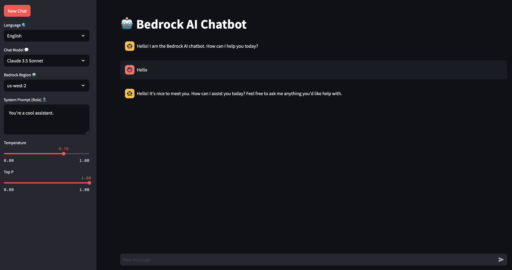
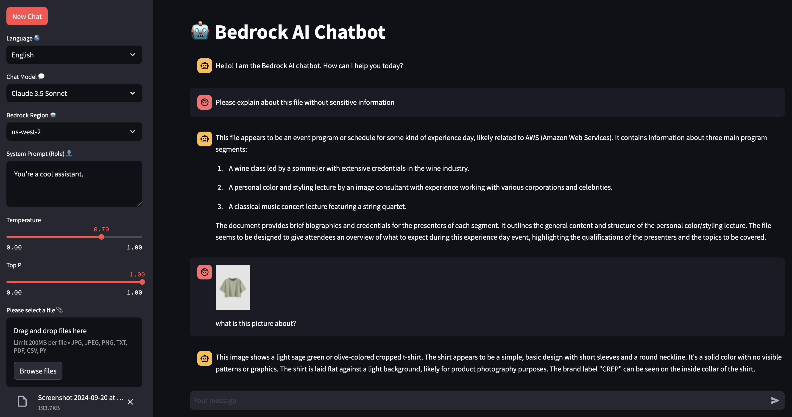
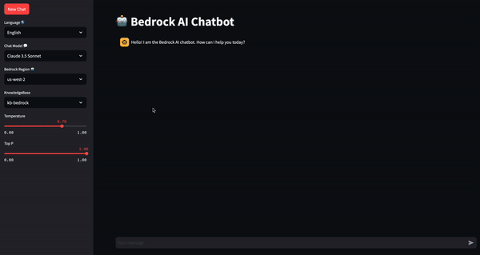
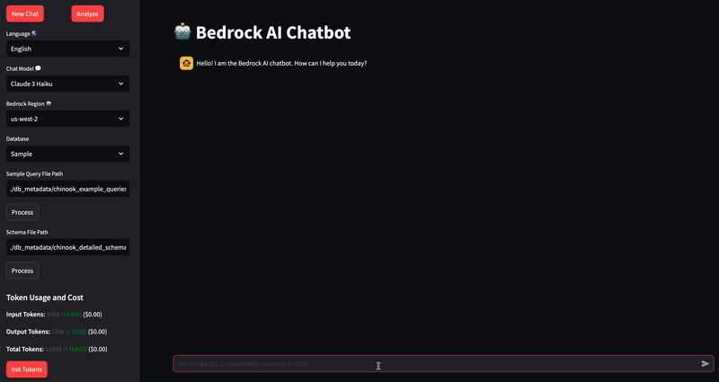

# Bedrock-based Chatbot Application


## Execution Steps

1. Install the required packages:
```
pip install -r requirements.txt
```

*Note: Since multiple libraries will be installed, dependency errors may occur depending on your environment. Check version compatibility with your existing environment before installation.

2. Run the desired chatbot application:
```
streamlit run {Chatbot file}.py
```

## Examples

### 1. **Basic Chat**
```
streamlit run 1.basic-chat.py
```


- Select a model
- Input system prompt
- Control model parameters
- Support multi-turn conversations (chat history)
- Utilize Bedrock Converse API for model invocation

### 2. **Chat with Input**
```
streamlit run 2.chat-with-input.py
```


- Select a model
- Input system prompt
- Support multi-turn conversations (chat history)
- Provide files as input to the Bedrock Converse API
    - Supported types: Image, PDF, CSV, Python code, etc.

### 3. **Chat with Knowledge Base**
```
streamlit run 3.chat-with-knowledge-base.py
```


- Select a model
- View available KnowledgeBase list (*Requires prior creation of KnowledgeBase in Amazon Bedrock console [Link](https://docs.aws.amazon.com/bedrock/latest/userguide/knowledge-base-create.html))
- Search and retrieve context from KnowledgeBase ([Retrieve API](https://boto3.amazonaws.com/v1/documentation/api/latest/reference/services/bedrock-agent-runtime/client/retrieve.html#))
- Generate responses based on retrieved context
- Provide source and score of retrieved context


### 4. **Chat Text2SQL**

```
streamlit run 4.chat-text2sql.py
```


- Query database based on user questions
- Directly input database URI or use sample database ([Chinook DB](https://github.com/lerocha/chinook-database))
- Implement Agentic Text2SQL workflow using Bedrock Converse API's Tool Use feature
- Index pre-prepared sample queries and schema documents in OpenSearch
    - Refer to the sample query and schema preparation process [Link](https://github.com/kevmyung/db-schema-loader)
- RAG-based query composition
- Execute composed queries on the DB and save results to a CSV file
- Visualize query results using Plotly