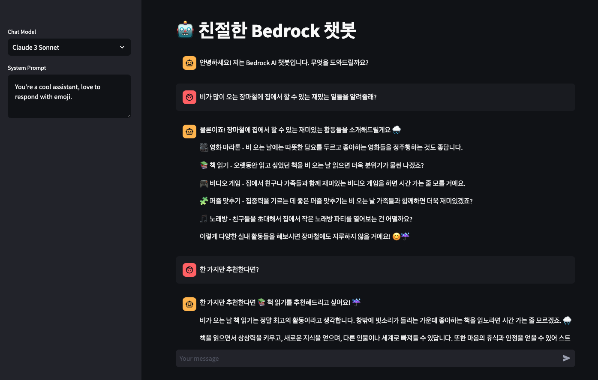
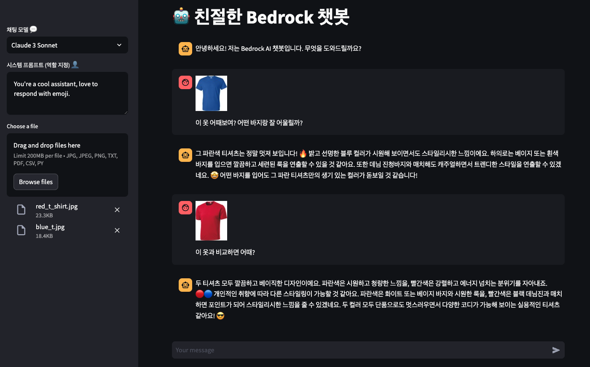
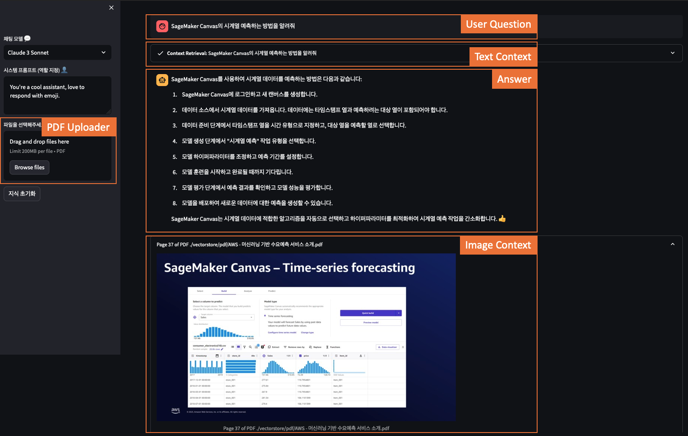
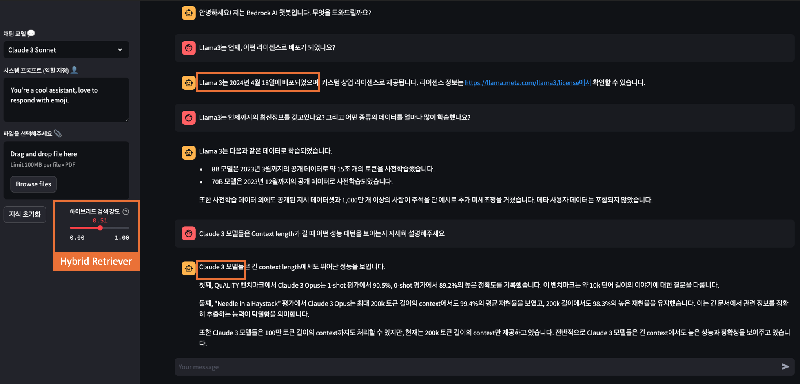
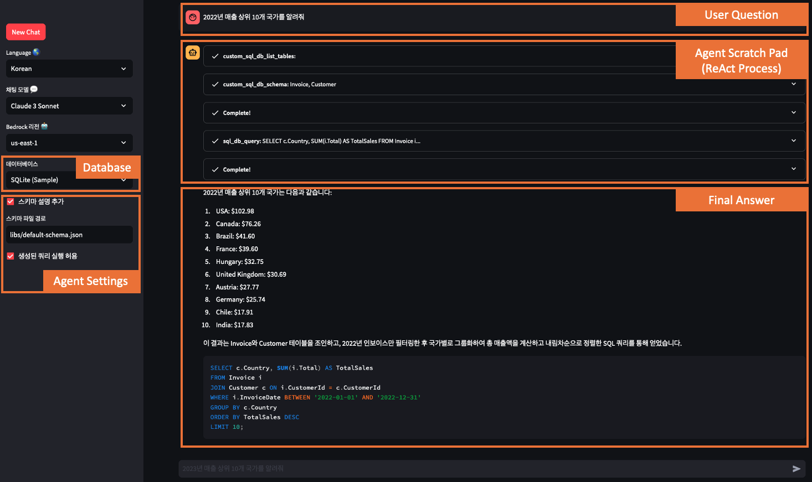
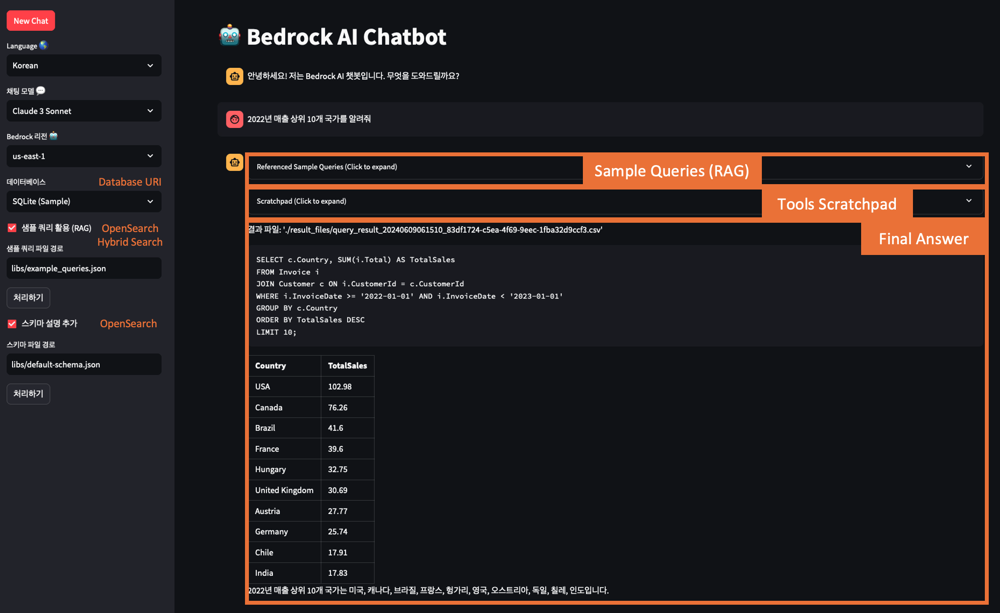
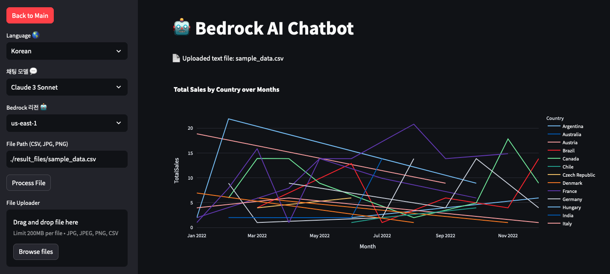
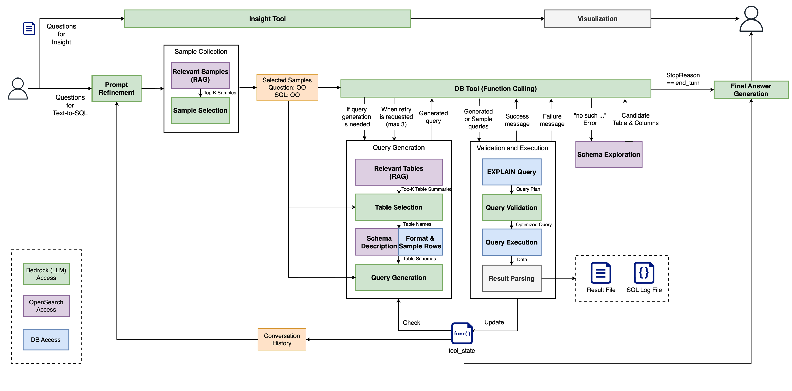

# Bedrock-based Chatbot Application


## Execution Steps

1. Install the required packages:
```
pip install -r requirements.txt
```
*Note: Since multiple libraries will be installed, dependency errors may occur depending on your environment. Check version compatibility with your existing environment before installation.

2. Run the desired chatbot application:
```
streamlit run {Chatbot file}.py
```

## Examples

### 1. **Basic Chat**
```
streamlit run 1.basic-chat.py
```

- Select a Bedrock-based model
- Provide a system prompt
- Use a conversation memory buffer
- Base code:  [Bedrock-ChatBot-with-LangChain-and-Streamlit](https://github.com/davidshtian/Bedrock-ChatBot-with-LangChain-and-Streamlit)

### 2. **Chat with Input**
```
streamlit run 2.chat-with-input.py
```

- Basic chatbot features  (`1. Basic Chat`)
- Utilize file input as "Short Term Memory"
    - Supported input types: images, PDFs, CSV, Python code, etc.

### 3-1. **Chat RAG FAISS with Image Context**
```
streamlit run 3-1.chat-rag-faiss.py
```

- Basic chatbot features (`1. Basic Chat`)
- Utilize file input as "Long Term Memory"
    - Convert input PDF files into vectors (Bedrock embedding model)
    - Store converted vectors in FAISS local database
    - Perform semantic search on user queries to provide context for answers
- Save PDF pages as images and provide them as context for search results
    - Additional library `sudo apt-get install poppler-utils`
 
### 3-2. **Chat RAG OpenSearch with Hybrid Retriever**
1. Create an OpenSearch cluster using the CloudFormation file (`cloudformation/setup_opensearch.yaml`)
    - Existing clusters can be reused
2. Update the connection information in the `libs/opensearch.yml` file
3. Run the chatbot application
```
streamlit run 3-2.chat-rag-opensearch-hybrid.py
```

- Basic chatbot features (`1. Basic Chat`)
- Utilize file input as "Long Term Memory"
    - Convert input PDF files into vectors (Bedrock embedding model)
    - Store converted vectors in an Amazon OpenSearch Service cluster
    - Perform semantic and textual search on user queries, combining results (ensemble) to provide context for answers
- OpenSearch Hybrid Search Base Code: [aws-ai-ml-workshop-kr](https://github.com/aws-samples/aws-ai-ml-workshop-kr/blob/master/genai/aws-gen-ai-kr/utils/rag.py)

### 4. **Chat SQL Agent**
```
streamlit run 4.chat-sql-agent.py
```

- Convert and execute user's natural language requests into SQL using Langchain XML Agent
- Utilize sample database ([Chinook DB](https://github.com/lerocha/chinook-database)) or input database URI 
- Refer to detailed descriptions of DB schema (tables/columns) using OpenSearch
- Reference RAG pattern for sample queries using OpenSearch Hybrid Search

### 5. **Chat SQL Tools**
**(Optional) SPIDER Database Download**:
This file is a flattened version of the original SPIDER dataset (`db.table`->`db_table`).
```bash
git lfs install
git lfs pull
```
**Run:**
```bash
streamlit run 5.chat-sql-tools.py
```

- Convert and execute user's natural language requests into SQL using Amazon Bedrock [Tool Use](https://docs.aws.amazon.com/bedrock/latest/userguide/tool-use.html)
- Utilize Sample Database1 - Simple ([Chinook DB](https://github.com/lerocha/chinook-database)) or input database URI
- Utilize Sample Database2 - Complex ([SPIDER DB](https://github.com/taoyds/spider))
- Prepare reference data [Link](https://github.com/kevmyung/db-schema-loader)
    - Apply RAG pattern to example queries using OpenSearch
    - Apply RAG pattern to DB schema (table summaries) using OpenSearch
- Refine user requests into suitable prompts
- Optimize based on query plan
- Save query results (CSV) and SQL logs
- Visualize query results (CSV) or image (PNG, JPG).

- Overall Workflow
